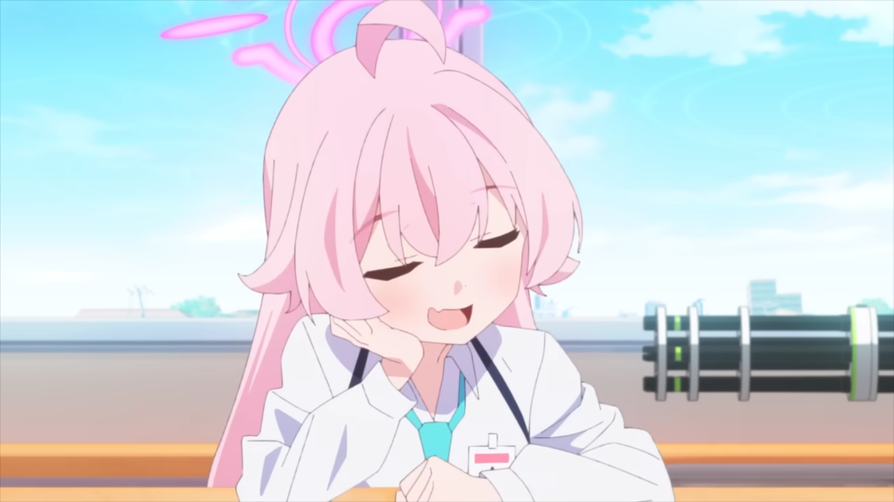

  <picture>
    <source media="(prefers-color-scheme: dark)" srcset="contents/filters_quality(95)format(webp).png" style="border-radius=15px;">
    <source media="(prefers-color-scheme: light)" srcset="contents/filters_quality(95)format(webp).png" style="border-radius=15px;">
    
  </picture>

 

# Minecraft-Ursina-Edition (•_•)
- Introducing New Minecraft Edition
- To Get Started, Go To How-To-Use Folder To Read All Information.
- This Game Requires All The Following Conditions:
- [x] Python 3.11 Or Newer
- [x] Installed Ursina Engine
- [x] Running On Windows, Linux
- [ ] Running On Mac
- [x] Accessories Requires:
    - [x] Keyboard
    - [x] Mouse
    - [ ] Launcher (On Android)
# 1. Features:
- New Following Features:
   - New Blocks:
      - [x] Cherry Woods, Leaves
      - [x] Copper Blocks
